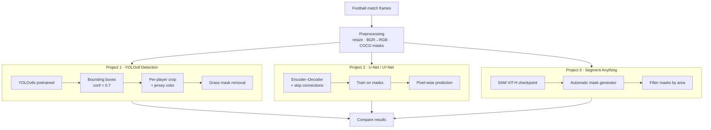

# ⚽ Football Player Tracking

> Detecting and segmenting football (soccer) players from broadcast frames using three complementary computer-vision approaches.

**Author:** Mohammad Javad Maheronnaghsh
**Dataset:** [Football Player Segmentation (Kaggle)](https://www.kaggle.com/datasets/ihelon/football-player-segmentation/code)


---

## 📋 Overview

This project explores **player detection and segmentation** on football match images. After a short literature review (Google Scholar, Kaggle, GitHub), three different methods were implemented and compared, ranging from off-the-shelf object detectors to trained segmentation networks and foundation models.

| # | Method | Type | Framework | Idea |
|---|--------|------|-----------|------|
| 1 | **YOLOv8** (Ultralytics) | Object detection | PyTorch | Bounding boxes around each player + jersey-color / grass-mask analysis |
| 2 | **U-Net & U²-Net** | Semantic segmentation | TensorFlow / Keras | Pixel-level player masks, trained on the dataset annotations |
| 3 | **Segment Anything (SAM)** | Promptable segmentation | PyTorch | Zero-shot automatic mask generation from a foundation model |

---

## 🔄 Process Pipeline



---

## 🧩 Methods in Detail

### 1. YOLOv8 — Detection & Analysis
Uses the pretrained **`yolov8x`** model from [Ultralytics](https://github.com/ultralytics/ultralytics) to detect players (COCO `person` class) with a confidence threshold of `0.7`. Each detection returns two corner points `(x, y)` and `(x2, y2)` plus a class and confidence score. The detected crops are further analysed to estimate **jersey colors** and to build a **grass mask** (background subtraction) so player pixels can be isolated from the pitch.

### 2. U-Net & U²-Net — Segmentation
- **U-Net**: a U-shaped encoder–decoder with skip connections (contracting path → expansive path) producing pixel-level masks.
- **U²-Net**: a nested U-structure built from **Residual U-Blocks (RSU-L)** instead of plain convolutional blocks — a six-stage encoder, five-stage decoder, and a saliency-map fusion module.

COCO-style polygon annotations are converted to binary masks (via `imantics`), images resized to `512×512`, and both models are trained and then compared side-by-side against the ground truth.

### 3. Segment Anything (SAM)
Uses Meta AI's [**Segment Anything Model**](https://arxiv.org/pdf/2304.02643.pdf) with the ViT-H checkpoint and the `SamAutomaticMaskGenerator` to produce zero-shot masks, then filters them by area to keep player-sized regions.

---

## 🖼️ Sample Results

| | |
|---|---|
|  |  |
|  | |

---

## 🚀 Getting Started

All code lives in [`football-tracking-final_release.ipynb`](./football-tracking-final_release.ipynb). The notebook was developed on **Kaggle** (with the dataset mounted under `/kaggle/input`).

```bash
# clone
git clone https://github.com/mjmaher987/Football-Player-Tracking.git
cd Football-Player-Tracking

# key dependencies
pip install ultralytics tensorflow opencv-python imantics
pip install git+https://github.com/facebookresearch/segment-anything.git
```

Then open the notebook and run the section for the approach you want to explore (each project is self-contained).

### Standalone Kaggle notebooks
- [YOLOv8 player detection](https://www.kaggle.com/code/mjmaher987/football-player-detection)
- [Segmentation with U-Net & U²-Net](https://www.kaggle.com/code/mjmaher987/football-players-segmentation-with-tf-unet-u2net)
- [Segment Anything — how to](https://www.kaggle.com/code/mjmaher987/segment-anything-model-how-to)

---

## 📄 License

See [LICENSE](./LICENSE).
